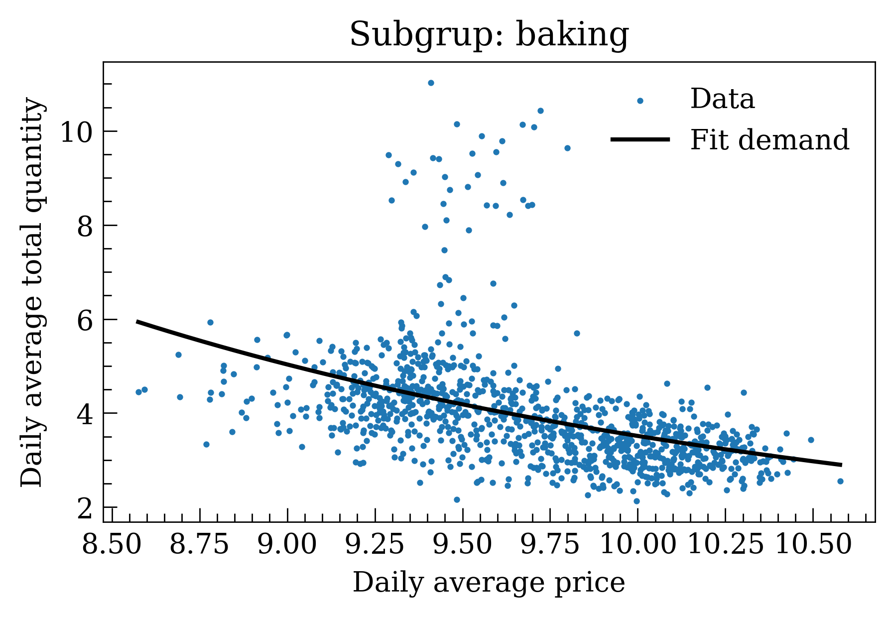
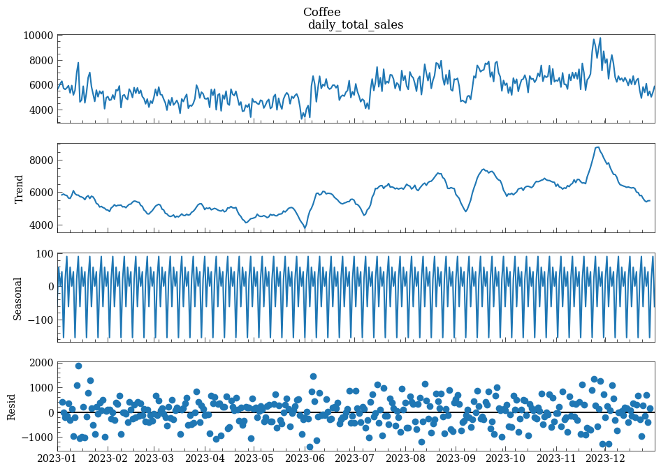
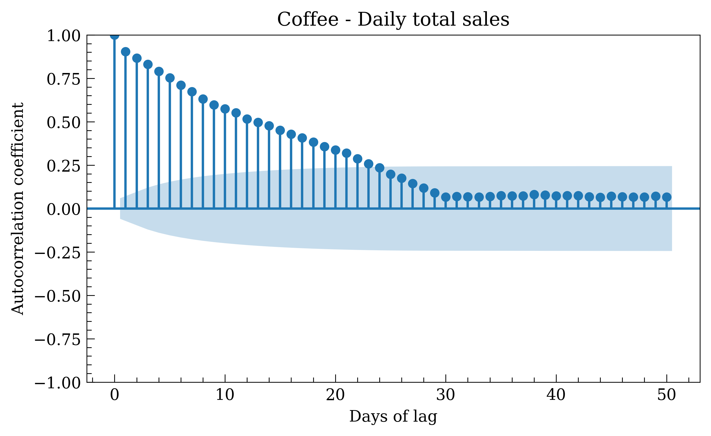
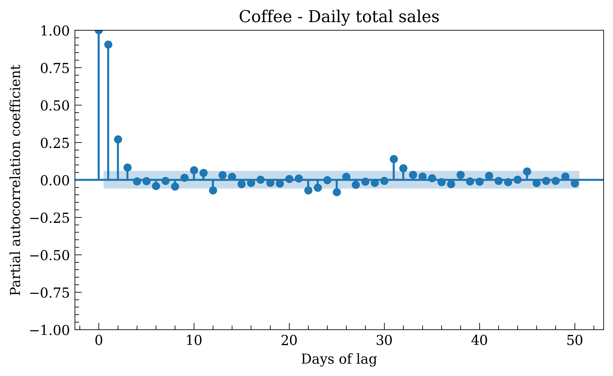
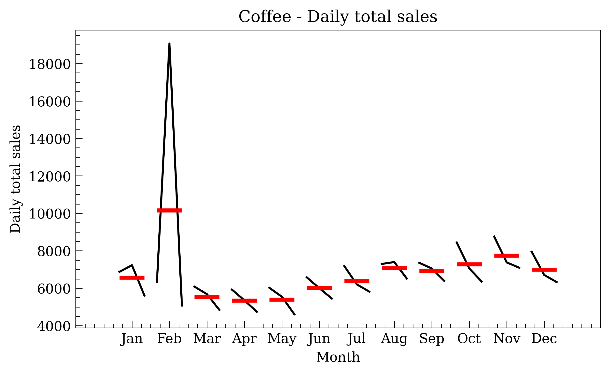
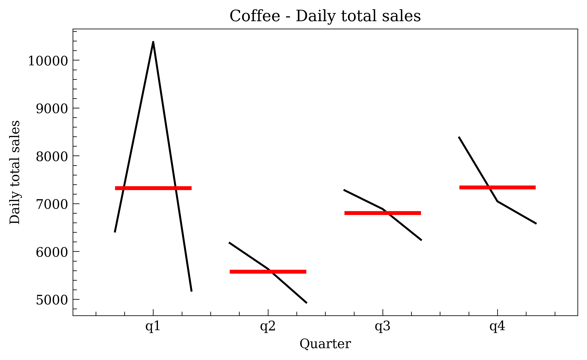

# AlixPartners-ECI Data Science Challenge 2025

This repository contains the material needed in the 2025 AlixPartners-ECI Data Science Challenge - La Casa de Asterión: Demand estimation and price optimization of retail items

# Business Report

## Introduction

After analyzing transaction data from various products and stores provided by *La Casa de Asterión*, a robust machine learning model was trained to predict demand (total sales) for each **product–store** combination, for each day of the week from **January 1, 2024 to January 7, 2024** (inclusive).  

Using this predictive model, this report presents the **pricing strategy** recommended to maximize the company’s **total profit** during the given week.  

---

## Demand Model  

The pricing strategy is based on selecting a **power-law demand model**, which states that the average total daily quantity sold by a store for a given product is:

```math
Q(p) = Q_0 \left( \frac{p}{p_0} \right)^E,
```

where:  
- $`p_{0}`$: reference price (chosen as the `base_price` from the **PRODUCT MASTER** dataset),
- $`Q_{0}`$: demand corresponding to $`p_{0}`$,
- $`p`$: average daily selling price,
- $`E`$: price elasticity for the product.

Thus, the daily total revenue can be expressed as:

```math
T(p) = p \, Q_0 \left( \frac{p}{p_0} \right)^E,
```

or equivalently:

```math
T(p) = Q_0 \, p_0^{-E} \, p^{1+E} \tag{1}.
```

This model describes the revenue behavior for each product in each store, provided that the parameters $`Q_{0}`$ and $`E`$ are known.

---

## Parameter Estimation  

Using the company’s historical data, a statistical analysis of demand $`Q`$ as a function of price was carried out. For each of the **74 products**, the best-fitting parameters $`Q_0`$ and $`E`$ were identified.

- Elasticity $`E`$ was assumed **constant** over the 3-year dataset, neglecting changes in base price due to inflation, competition, etc.  
- The same elasticity was assumed across all stores for each product.  

This allowed us to establish demand laws that best describe the financial behavior of each product. For the category *Accessories*, the fitted demand curve is shown below.



---

## Optimal Price Derivation  

Having identified $`E`$ and $`Q_{0}`$, the **optimal price** can be derived from equation (1) as the price that maximizes profit:

```math
p_{\text{opt}} = \left( \frac{p_0^E \, \hat{T}}{Q_0} \right)^{\frac{1}{1+E}} \tag{2}.
```

In the equation above $`\hat{T}`$ is the predicted daily total sales for a product–store pair.

### Cost Constraint

Since the theoretical $`p_{\text{opt}}`$ may fall below the **manufacturing (cost) price**, the following rule was applied:  

```math
p_{\text{opt}} =
\begin{cases}
1.1 \cdot p_{\text{cost}} & \text{if } p_{\text{opt}} \leq 1.1 \cdot p_{\text{cost}}, \\
\left( \frac{p_0^E \, \hat{T}}{Q_0} \right)^{\frac{1}{1+E}} & \text{otherwise}.
\end{cases}
```

This ensures a **minimum 10% added value** above cost.  

---

## Elasticity Insights  

- **Lowest elasticity:** *Cleansers*, $`E = -3.965`$.  
- **Highest elasticity:** *Speakers*, $`E = -0.460`$ (the only inelastic product, since $`-1 < E < 0`$).  
- **Average elasticity across products:** $`E = -2.375`$.  

This suggests that *Speakers* represent a unique strategic opportunity, while all other products show elastic demand ($`E < -1`$).

---

## Pricing Strategy Dataset  

The results are provided in the file **`pricing_strategy.csv`**, containing the following columns:

- **STORE_SUBGROUP_DATE_ID**: unique identifier (store, product subgroup, and date).
- **TOTAL_SALES**: actual sales corresponding to the record.  
- **DATE**: date of the record.
- **STORE_ID**: store identifier.
- **SUBGROUP**: product identifier.
- **OPTIMAL_PRICE**: recommended optimal price.
- **ADDED_VALUE**: added value percentage relative to cost price ($`≥ 10\%`$).
- **PROFIT**: net profit for the given store–product–date.
- **ELASTICITY**: elasticity value of the product.

---

## Model Performance  

To evaluate the model performance it was used the $`R^{2}`$ metric. Thus, the final chosen model had a explained variability of $`14.037\%`$. As a reference, a naïve baseline model (predicting mean sales) gave back a negative performance, which is unacceptable.

Given the large number of products and stores, the obtained performance is considered **very good** for a financial forecasting problem.  

---

## Conclusion  

The **`OPTIMAL_PRICE`** column in the attached dataset represents the recommended pricing strategy to **maximize profits** for the week of **January 1–7, 2024**.  

This strategy, combined with elasticity insights and profit safeguards, provides a practical guideline for *La Casa de Asterión* to achieve financial optimization across its retail operations.  

---

# Code report

## Introduction  

This project uses transaction data from a fictional company called *La Casa de Asterión*. The dataset consists of information about past transactions, the products sold, the stores involved, and the customers who carried out those transactions.  

The **main objective** of the project is to predict the demand the company will face in the week following the last available temporal data, for **each product subgroup** and **each store**. The ultimate goal is to **maximize the company’s profit**.  

---

## Methodology  

The implemented methodology follows several steps designed for the development of a high-quality forecasting model.  

Our guiding philosophy was:  

> A single generic model cannot efficiently capture the unique behaviors of each store–product combination.  

Therefore, we developed a **store-aware forecasting system**, structured in several steps:  

---

### 1. Data Cleaning  

The first step involved consolidating and cleaning transaction, product, and store data. The process included:  

- **Data Aggregation**:  
  Individual transactions were aggregated to form a **daily time series** for each unique combination of `STORE` and `SUBGROUP`.  

- **Temporal Filtering**:  
  To ensure pattern relevance, the model focused on the **last two years** of historical data.  

- **Outlier Handling**:  
  Instead of removing outliers (which may represent special events), we applied **Winsorization**.  
  - Extreme values were capped at a high percentile (e.g., $`99.5\%`$), mitigating their disproportionate impact while preserving event signals.  

- **Missing Values**:  
  A robust strategy was implemented to handle missing data. Logical placeholders such as `"Unknown"` were assigned to categories like store type or region, ensuring that no series was discarded due to missing metadata.  

---

### 2. Feature Engineering  

To allow the model to learn complex patterns, a set of highly informative features was created from the raw data. Key features included:  

- **Smart Business Calendar**:  
  A custom calendar that identifies not only key U.S. holidays (*Black Friday, Christmas, etc.*), but also **promotional windows** (days before and after these events), which are critical in retail.  

- **Temporal Features**:  
  Lag variables and moving averages were built to capture inertia and recent sales trends (e.g., sales at lags of 1, 7, 14, and 28 days).  

- **Seasonality Components**:  
  Using **Fourier terms** (sine and cosine), the model accurately captured weekly cycles (e.g., weekend effects) and annual cycles.  

- **Price Dynamics**:  
  Features were added to capture price sensitivity, such as the logarithm of price and a rolling 28-day **elasticity estimate**.  

---

### 3. Modeling Strategy: Dynamic Clusters and Expert Models  

This is the **core** of our forecasting system.  

Instead of training:  
- one model per series (computationally expensive and unstable for highly intermittent data), or  
- one global model for all (too generic),  

we adopted a **hybrid approach**:  

#### Step 1: Automatic Segmentation with K-Means  
- Each time series (`store–subgroup`) was described using a set of **descriptors**:  
  average sales, volatility, recent trend, promotion rate, and elasticity.  
- Using **K-Means clustering**, series with similar behaviors were grouped together.  
- The **optimal number of clusters** was determined dynamically via the **silhouette score**, ensuring statistical validity.  

#### Step 2: Training Specialized and Global Models  
- A **LightGBM model** was trained for each discovered cluster, allowing it to learn the specific patterns of that group of products.  
- In parallel, a **robust Global model** was trained using all data.  
  - This model acts as a **safety net**, covering cases where a series cannot be clustered or where `store` or `subgroup` metadata is missing.  
  - It can also be used to speed up predictions when needed.  

- Training involved:  
  - **Cross-validation with expanding windows** to find the best hyperparameters.  
  - **Sample weighting** to prioritize recent data (time decay).  

---

### 4. Prediction Process: A Hierarchical System  

The final system is not a simple ensemble, but a **hierarchical forecasting architecture**:  

1. **Cluster Model (Primary Choice):**  
   For a given store–subgroup, the system first uses its assigned cluster model.  

2. **Global Model (First Backup):**  
   If the series is new or unclustered, the system falls back to the global model, which has a broad understanding of all patterns.  

3. **Backup Prediction (Safety Net):**  
   For completely new products with no history (e.g., NPLs — *New Product Launches*), the system provides an estimate based on historical averages, ensuring that a reasonable prediction is always produced.  

This hierarchical approach ensures predictions are both **specialized** and **robust**, adapting to the dynamic nature of retail.  

---

## Results  

The final predictions generated by this system were submitted to the competition platform, achieving:  

- **Private score:** 0.14037  
- **Public score:** 0.14120  

It is worth noting that we also tested alternative submissions with slightly different modeling strategies (e.g., stronger weight on the global model combined with series-specific models). Some of these achieved better private scores. Also, we tried a complete time series approach using Facebook Prophet and a deep-learning one, considering a feed-forward (MLP) for mixed tabular data, but both gave unacceptable results.

However, in this report we share the code that produced the **best public leaderboard performance**.  

---

### Appendix - Graphs used to analyze the data

Graphs were used to visualize the different components of a time series, such as trend and seasonality; graphs illustrating the residuals of said series; graphs showing the temporal evolution of different variables by month and by quarter over the course of the different years; and graphs of the autocorrelation function and partial autocorrelation function. These graphs are shown below, using the "Coffee" product as an example.







### Data Policy:

The data used in the project was exclusively for the competition. This dataset is private and will not be shared.

### References

[1]: [Complete Time Series Analysis and Forecasting with Python](https://www.youtube.com/watch?v=eKiXtGzEjos&ab_channel=DataHeroes)

[2]: [Forecasting: Principles and Practice, the Pythonic Way](https://otexts.com/fpppy/)